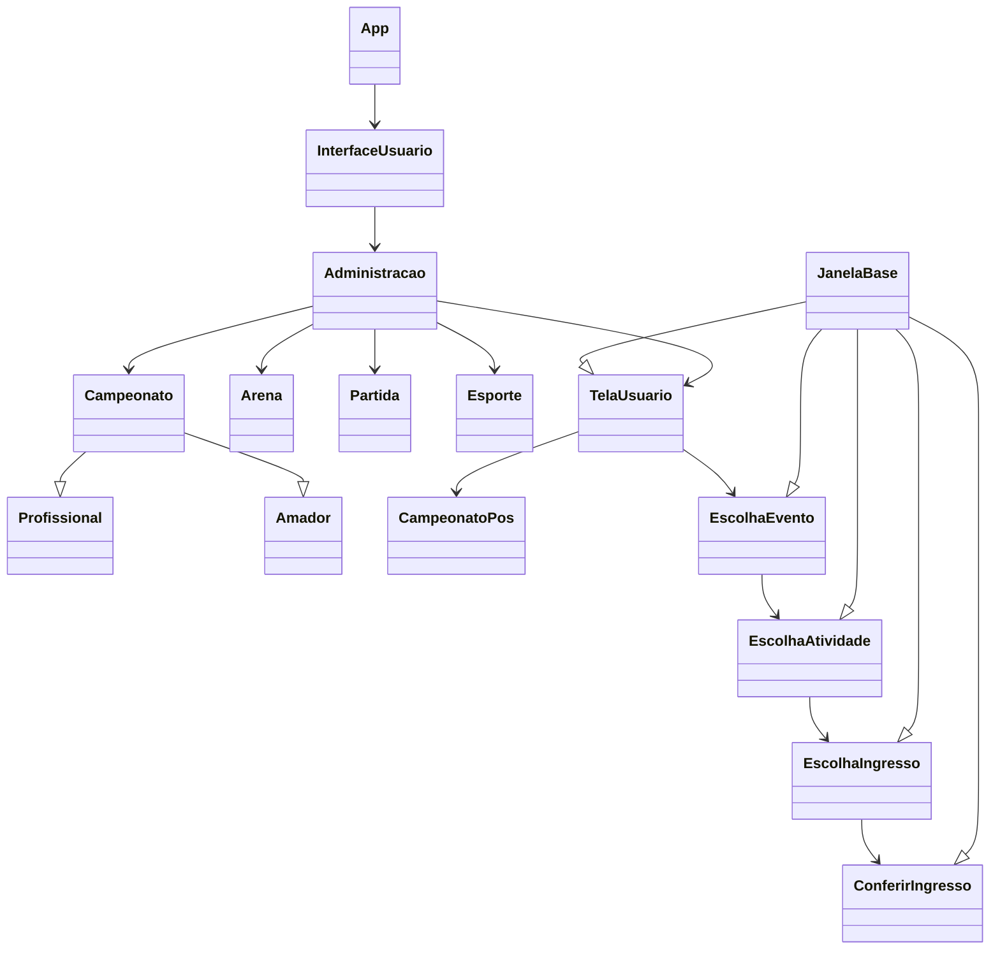

# Trabalho de PPOO - Sistema de Recomendação

Veja as Instruções do Trabalho no Campus Virtual da disciplina.

Preencha os campos abaixo de acordo com as intruções dadas.

## Definição do Grupo

**Nome do grupo**: 3 espioes demais

**Tema escolhido**: Eventos Esportivos

**Integrantes** (preencha abaixo): 

- Andre Ulhoa Werneck
- Bernardo Nunes Leris
- João Paulo Chaves Gonçalves Elias 

## Checklist para a Primeira Entrega

**Preencha a coluna _Respostas_** na tabela abaixo **antes de fazer a primeira entrega**.

- Obs.: a coluna _Id_ indica a seção das Instruções do trabalho.

|  Id   |  Descrição                                                         | Respostas | 
|-------|--------------------------------------------------------------------|-----------|
| 2.1.1 | O sistema permite cadastrar eventos?                               | (sim) |
| 2.1.1 | O sistema permite listar eventos?                                  | (sim) |
| 2.1.1 | O sistema permite remover eventos?                                 | (sim) |
| 2.1.2 | O sistema permite cadastrar locais?                                | (sim) |
| 2.1.2 | O sistema permite listar locais?                                   | (sim) |
| 2.1.2 | O sistema permite remover locais?                                  | (sim) |
| 2.1.3 | O sistema permite cadastrar atividades?                            | (sim) |
| 2.1.3 | O sistema permite listar atividades?                               | (sim) |
| 2.1.3 | O sistema permite remover atividades?                              | (sim) |
| 3.1.3 | O código implementado tem bom design de classes?                   | (sim) |
| 3.1.4 | O código implementado respeita divisão de camadas?                 | (sim) |
| 3.1.5 | O código faz uso de herança? Tem superclasse e subclasses?         | (sim) |
| 3.1.6 | Foi feito diagrama de classes UML?                                 | (sim) |
| 3.1.7 | Código enviado compila sem erros na versão 17 ou superior do Java? | (sim) |
| 3.1.7 | Implementação usa pacote `br.ufla.gac106.s2023_1.nomeDoGrupo`?     | (sim) |
| 3.1.7 | Foi adicionada alguma biblioteca (arquivo `.jar`)?                 | (não) |
| 3.1.7 | Código está legível, organizado e bem comentado?                   | (sim) |

## Checklist para a Entrega Final

**Preencha a coluna _Respostas_** na tabela abaixo **antes da entrega final**.

- Obs.: a coluna _Id_ indica a seção das Instruções do trabalho.

|  Id   |  Descrição                                                                  | Respostas | 
|-------|-----------------------------------------------------------------------------|-----------|
| 2.1   | Sistema trata todos os itens do Módulo de Administração (primeira entrega)? | (sim) |
| 2.1.0 | O sistema salva os dados cadastrados em arquivo?                            | (sim) |
| 2.2.1 | Módulo de compras de ingresso exibe listagem dos eventos cadastrados?       | (sim) |
| 2.2.2 | Sistema exibe detalhes (dados cadastrais) de um evento selecionado?         | (sim) |
| 2.2.2 | Sistema exibe atividades de um evento selecionado, incluindo número de ingressos disponíveis (sim) |
| 2.2.3 | Sistema permite que usuário escolha a quantidade de ingressos por tipo?     | (sim) |
| 2.2.3 | Sistema trata os três tipos de ingresso, com preços diferentes?             | (não) |
| 2.2.3 | Sistema usa herança para tratar os tipos de ingresso?                       | (sim) |
| 2.2.4 | Sistema confere se quantidade de ingressos solicitada está disponível?      | (sim) |
| 2.2.4 | Ao finalizar compra a quantidade de ingressos e preço total são exibidos?   | (sim) |
| 2.2.5 | Sistema gera arquivo PDF com os ingressos comprados?                        | (sim) |
| 2.2.6 | Informações necessárias sobre ingressos disponíveis são persistidas em arquivo?  | (sim) |
| 2.2.7 | Módulo de relatórios exibe gráfico por evento?                              | (não) |
| 2.2.7 | Módulo de relatórios exibe gráfico por atividade?                           | (não) |
| 3.1.3 | O código implementado tem bom design de classes?                            | (sim) |
| 3.1.4 | O código implementado respeita divisão de camadas?                          | (sim) |
| 3.1.5 | O código faz uso de herança? Tem superclasse e subclasses?                  | (sim) |
| 3.1.6 | Foi feito diagrama de classes UML?                                          | (mermaid) |
| 3.1.7 | Código enviado compila sem erros na versão 17 ou superior do Java?          | (sim) |
| 3.1.7 | Implementação usa pacote `br.ufla.gac106.s2023_1.nomeDoGrupo`?              | (sim) |
| 3.1.7 | Foi adicionada alguma biblioteca (arquivo `.jar`)?                          | (não) |
| 3.1.7 | Código está legível, organizado e bem comentado?                            | (sim) |
| 3.1.8 | Código faz uso de variável polimórfica?                                     | (sim) |
| 3.1.8 | Código faz uso de polimorfismo de método?                                   | (sim) |
| 3.1.9 | Há tratamento de exceção para entradas inválidas do usuário?                | (não) |
| 3.1.9 | Há tratamento de exceção para programa não fechar por erro de execução?     | (não) |
| 3.1.10| Código inicial fornecido pelo professor foi alterado (incluindo pacote)?    | (não) |
| 3.1.11| Módulo de compra de ingressos possui interface gráfica?                     | (sim) |
| 3.1.11| Módulo de relatórios possui interface gráfica?                              | (não) |
| 3.1.11| Módulo de administração possui interface gráfica? (opcional)                | (não) |
| 3.1.12| Há implementação de algum Padrão de Projeto? (opcional)                     | (não) |

## Auto-avaliação sobre o Trabalho Prático

1. Todos os integrantes contribuíram com o desenvolvimento do trabalho, inclusive na implementação?

> Sim.

2. O que acham que foi mais complexo fazer no trabalho?

> A leitura dos dados do arquivo texto para que eles fossem interpretados pela interface gráfica.

3. E o que acham que foi mais interessante no trabalho?

> A utilização efetiva da herança, método de construção de classes que pode ser de grande magnitude nas práticas de orientação a objetos, principalmente em futuras oportunidades de trabalho na área do desenvolvimento de software.

4. Qual nota dariam para o trabalho de vocês

> 80%.

5. Teriam alguma sugestão de mudança nas instruções do trabalho se estivessem começando a fazê-lo agora?

> Colocar em tópicos claros e simples o que deveria ser feito no trabalho prático ao todo, especificando os tópicos no decorrer do trabalho.

## Diagrama UML

